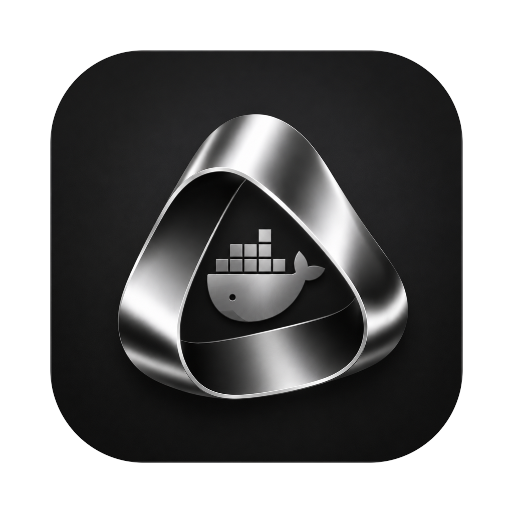
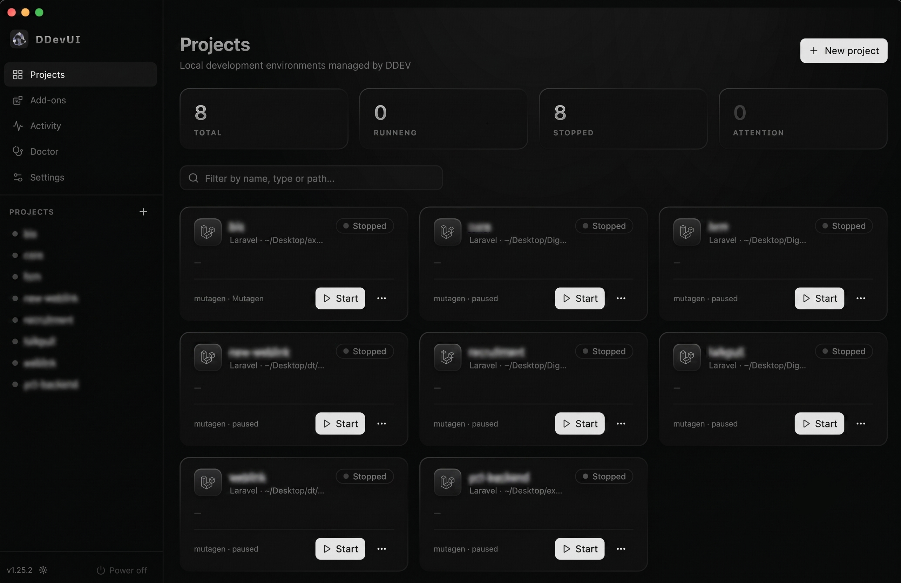

<p align="center">
  
</p>

<h1 align="center">DDevUI</h1>

<p align="center">
  A polished desktop app for managing <a href="https://ddev.com">DDEV</a> local development
  environments — everything the <code>ddev</code> CLI does, behind a beautifully designed UI.
</p>

<p align="center">
  Built with
  <a href="https://www.electronjs.org">Electron</a> ·
  <a href="https://react.dev">React 19</a> ·
  <a href="https://tailwindcss.com">Tailwind v4</a> ·
  <a href="https://ui.shadcn.com">shadcn/ui</a> ·
  <a href="https://animate-ui.com">Animate UI</a>
</p>

<p align="center">
  <a href="https://github.com/shiv122/ddev-ui/releases/latest"></a>
  <a href="https://github.com/shiv122/ddev-ui/releases"></a>
  
  <a href="LICENSE"></a>
</p>

<br />

<div align="center">
  
</div>

<br />

## Overview

[DDEV](https://ddev.com) is a fantastic CLI for spinning up containerized local development
environments, but everything lives behind `ddev` subcommands and YAML config. **DDevUI** puts a
fast, native-feeling desktop app on top: every project, its status, logs, database, add-ons and
configuration in one monochrome, dark-mode-ready interface — without ever touching the terminal.

It talks to DDEV exclusively through `ddev <cmd> --json-output`, so there's no parsing of
human text and no hidden shell commands — just typed, allow-listed invocations.

## Download

Grab the installer for your platform from the
**[latest release](https://github.com/shiv122/ddev-ui/releases/latest)**:

| Platform | File |
| --- | --- |
| **macOS** (Apple Silicon) | `ddevui-<version>-mac-arm64.dmg` |
| **macOS** (Intel) | `ddevui-<version>-mac-x64.dmg` |
| **Windows** | `ddevui-<version>-win-x64.exe` |
| **Linux** | `ddevui-<version>-linux-x86_64.AppImage` · `-linux-amd64.deb` |

> [!NOTE]
> **macOS first launch.** Builds are ad-hoc signed but **not notarized** (no Apple Developer ID),
> so Gatekeeper shows an "unidentified developer" prompt the first time. Either **right-click the
> app → Open** and confirm (once), or clear the quarantine flag:
> ```sh
> xattr -dr com.apple.quarantine /Applications/DDevUI.app
> ```

## Requirements

DDevUI is a front-end for DDEV — you still need DDEV and a container runtime installed:

- **[DDEV](https://ddev.readthedocs.io/en/stable/users/install/ddev-installation/)** v1.24+
- A **Docker provider** — Docker Desktop, OrbStack, Colima, or Rancher Desktop

The built-in **Doctor** page checks all of this and tells you exactly what's missing (and lets
you point the app at a `ddev`/`docker` binary manually if it isn't on the default `PATH`).

## Features

- **Dashboard** — every project with live status, filtering and animated stats; one-click
  start / stop / restart / open-in-browser / Mailpit.
- **Project detail** — environment overview (PHP, webserver, DB, Node, Mutagen, router),
  per-service container health, all URLs, and an **Xdebug toggle**.
- **Database tools** — connection credentials with copy buttons, dump **import/export** via
  native file dialogs, and **snapshots** (create / restore / delete).
- **Interactive terminal** — a real shell into any service via `ddev ssh`, powered by xterm.js
  and a PTY — not a one-shot command box.
- **Logs** — stream `ddev logs` per service with follow mode.
- **Config** — UI-driven settings (PHP version, database, webserver, performance mode, URLs,
  PHP extensions, hostnames) that run `ddev config`, plus a config viewer.
- **Create-project wizard** — pick a folder and type, including custom templates beyond Laravel
  (Next.js, Vite, Express, FastAPI, Django, Flask) on DDEV's `generic` type, with an optional
  database.
- **Add-on registry** — search the full registry (`ddev add-on list`), filter official/community,
  sort by stars, install into any project, and remove installed add-ons.
- **Advanced** — custom Docker services & compose files, Dockerfile tweaks, custom commands, TLS
  certs, Traefik config and hooks, each with clear warnings.
- **Sharing** — expose a project publicly via `ddev share` (ngrok / cloudflared), entirely
  optional and never blocking.
- **Activity** — every ddev command the app runs, with live streamed output and cancel.
- **Doctor** — checks the ddev binary, Docker CLI + daemon and mkcert; runs the deep
  `ddev debug dockercheck`; shows the full `ddev version` table.
- **Menu bar** — a tray with live project status and quick lifecycle controls.
- **Light & dark themes** — monochrome, metallic design that follows a toggle; the dock and
  menu-bar icons follow along too.

## How it talks to DDEV

All data comes from `ddev <cmd> --json-output`, which emits NDJSON lines
(`{level, msg, time}`) where structured results carry a `raw` field. The main process
([src/main/ddev/runner.ts](src/main/ddev/runner.ts)) parses this envelope; long-running commands
stream through an operation manager ([src/main/ddev/operations.ts](src/main/ddev/operations.ts))
that broadcasts typed events to the renderer. The renderer never constructs CLI arguments — it
sends typed `OperationRequest` objects ([src/shared/types.ts](src/shared/types.ts)) and main maps
them to allow-listed invocations (spawned with arg arrays, never a shell).

## Architecture

```
src/
  shared/        types + IPC channel names (single contract for all layers)
  main/
    ddev/
      binary.ts      locate ddev/docker (GUI apps don't inherit shell PATH)
      runner.ts      NDJSON envelope parser, DdevError
      client.ts      typed queries: list/describe/version/add-ons/snapshots
      operations.ts  streamed long-running ops, per-project locking, cancel
      terminals.ts   node-pty sessions (ddev ssh) for the interactive terminal
      doctor.ts      environment checks
    tray.ts       menu-bar presence with live status + controls
    ipc.ts        ipcMain handlers (queries, ops, dialogs, openExternal)
  preload/       contextBridge: window.ddev (typed)
  renderer/src/
    api/hooks.ts       TanStack Query hooks (list polls every 5s)
    store/             useSyncExternalStore-based op store + toasts
    lib/               router (state-based), query client, theme, ddev options
    components/app/    shell, status badges, op console/dock, dialogs
    pages/             dashboard, project, create, addons, operations, doctor, settings
```

## Development

```bash
pnpm install
pnpm dev          # from a VSCode terminal: env -u ELECTRON_RUN_AS_NODE pnpm dev
pnpm typecheck
pnpm build:mac    # or build:win / build:linux
```

Requires Node 20+ and pnpm. Releases are built and published automatically by GitHub Actions
when a `v*` tag is pushed (see [.github/workflows/release.yml](.github/workflows/release.yml)).

## License

[MIT](LICENSE) © Shivesh Tripathi
